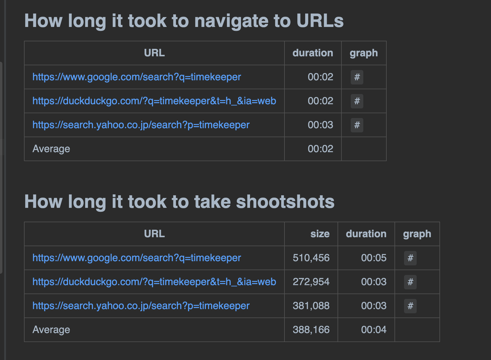

Timekeeper helps Java/Groovy test codes to record performance measurement statistics, and to compile reports in Markdown format.

# Motivation

Often I develop Web UI tests in Groovy using Selenium. I wanted to measure the performance of the tests. Often I want to measure:

1.  how long (seconds) tests take to navigate to a URL in browser

2.  how long tests take to take and save screenshot of a web page

3.  how large (bytes) is the generated image file

I want to examine many URLs; 100 or more. In practice, most of URLs respond in 3 seconds but a few of them respond slow (over 20 seconds). Why slow? I need to list the slow URLs up, and find what to do with them.

It is bothersome recording the duration with a stopwatch. It is tiresome to write a statistics report in Markdown table format. I desperately want to automate this task. I want my WebUI tests to perform performance measurement and reporting as well.

# Example

A `Timekeeper` object lets you create **one or more** `Measurement` objects. A `Measurement` object stands for a table which contains a header and one or more `Record` set. A `Record` contains columns and a duration in `mm:ss` format (minutes:seconds). My test will put an instance of `LocalDateTime.now()` just before the test calls a long running method call (such as Selenium navite, and taking screenshot). This timestatmp is recorded as `startAt`. Also my test will put another instance of `LocalDateTime.now()` just after the long-running method call. This timestamp is recorded `endAt`. Each record object can calculate the duration = endAt minus startAt. And finally Timekeeper’s `report(Path)` method can generate a text report in Markdown syntax.

## Example 1 --- minimalistic

## Example 2 --- Selenium test

Input CSV file is here:

    https://www.google.com/search?q=timekeeper,timekeeper_google.png
    https://duckduckgo.com/?q=timekeeper&t=h_&ia=web,timekeeper_duckduckgo.png
    https://search.yahoo.co.jp/search?p=timekeeper,timekeeper_yahoo.png

The test emits the following Markdown text:

    ## How long it took to navigate to URLs

    |URL|duration|duration graph|
    |:----|----:|:----|
    |https://www.google.com/search?q=timekeeper|00:02|`#`|
    |https://duckduckgo.com/?q=timekeeper&t=h_&ia=web|00:02|`#`|
    |https://search.yahoo.co.jp/search?p=timekeeper|00:02|`#`|

    ----
    ## How long it took to take shootshots

    |URL|duration|duration graph|
    |:----|----:|:----|
    |https://www.google.com/search?q=timekeeper|00:05|`#`|
    |https://duckduckgo.com/?q=timekeeper&t=h_&ia=web|00:03|`#`|
    |https://search.yahoo.co.jp/search?p=timekeeper|00:05|`#`|

    ----

This Markdown text will be rendered on browser like this:

The code is here:

    package com.kazurayam.timekeeper.demo

    import com.kazurayam.ashotwrapper.AShotWrapper
    import com.kazurayam.ashotwrapper.DevicePixelRatioResolver
    import com.kazurayam.timekeeper.Measurement
    import com.kazurayam.timekeeper.Timekeeper
    import io.github.bonigarcia.wdm.WebDriverManager
    import org.junit.jupiter.api.AfterEach
    import org.junit.jupiter.api.BeforeAll
    import org.junit.jupiter.api.BeforeEach
    import org.junit.jupiter.api.Test
    import org.openqa.selenium.Dimension
    import org.openqa.selenium.WebDriver
    import org.openqa.selenium.chrome.ChromeDriver
    import org.openqa.selenium.chrome.ChromeOptions

    import java.util.concurrent.TimeUnit;

    import java.awt.image.BufferedImage;
    import java.nio.file.Files
    import java.nio.file.Path
    import java.nio.file.Paths
    import javax.imageio.ImageIO
    import java.time.LocalDateTime

    import static org.junit.jupiter.api.Assertions.*;

    /**
     * learned "How to Take Screenshot in Selenium WebDriver" of Guru99
     * https://www.guru99.com/take-screenshot-selenium-webdriver.html
     */
    class TimekeeperDemo {

        private WebDriver driver_
        static private Path outdir_
        private AShotWrapper.Options aswOptions_ = null

        @BeforeAll
        static void setupClass() {
            WebDriverManager.chromedriver().setup();
            outdir_ = Paths.get(".")
                    .resolve("build/tmp/testOutput")
                    .resolve(TimekeeperDemo.class.getSimpleName())
            if (Files.exists(outdir_)) {
                outdir_.toFile().deleteDir();
            }
            Files.createDirectory(outdir_)
        }

        @BeforeEach
        void setupTest() {
            ChromeOptions options = new ChromeOptions();
            options.addArguments("--no-sandbox");
            options.addArguments("--disable-dev-shm-usage");
            options.addArguments("--headless");   // use Headless Chrome browser
            driver_ = new ChromeDriver(options);
            driver_.manage().timeouts().implicitlyWait(500, TimeUnit.MILLISECONDS);
            driver_.manage().window().setSize(new Dimension(1200, 800));
            //
            float dpr = DevicePixelRatioResolver.resolveDPR(driver_);
            aswOptions_ = new AShotWrapper.Options.Builder().devicePixelRatio(dpr).build();
        }

        @AfterEach
        void tearDown() {
            if (driver_ != null) {
                driver_.quit();
            }
        }

        @Test
        void test_demo() {
            Timekeeper tk = new Timekeeper()
            Measurement navigation = tk.newMeasurement("How long it took to navigate to URLs", ["URL"])
            Measurement screenshot = tk.newMeasurement("How long it took to take shootshots", ["URL"])
            // process all URLs in the CSV file
            Path csv = Paths.get(".").resolve("src/test/fixtures/URLs.csv");
            for (Tuple t in parseCSVfile(csv)) {
                String url = t.get(0)
                String filename = t.get(1)
                driver_.manage().timeouts().implicitlyWait(30, TimeUnit.SECONDS)
                // navigate to the URL, record the duration
                LocalDateTime beforeNavigate = LocalDateTime.now()
                driver_.navigate().to(url)
                LocalDateTime afterNavigate = LocalDateTime.now()
                navigation.recordDuration(["URL": url], beforeNavigate, afterNavigate)
                // take a screenshot of the page, record the duration
                LocalDateTime beforeScreenshot = LocalDateTime.now()
                this.takeFullPageScreenshot(driver_, outdir_, filename)
                LocalDateTime afterScreenshot = LocalDateTime.now()
                screenshot.recordDuration(["URL": url], beforeScreenshot, afterScreenshot)
            }
            // now print the report
            tk.report(outdir_.resolve("report.md"))
        }

        private void takeFullPageScreenshot(WebDriver driver, Path outDir, String fileName) {
            // using my AShotWrapper lib at https://kazurayam.github.io/ashotwrapper/
            BufferedImage image = AShotWrapper.takeEntirePageImage(driver, aswOptions_);
            assertNotNull(image);
            File screenshotFile = outDir.resolve(fileName).toFile();
            ImageIO.write(image, "PNG", screenshotFile);
            assertTrue(screenshotFile.exists());
        }

        /**
         * read a CSV file of:
         *
         * url1,filename1
         * url2,filename2
         * url3,filename3
         * ...
         *
         * @param csv
         * @return
         */
        private List<Tuple2> parseCSVfile(Path csv) {
            List<Tuple2> result = new ArrayList<Tuple2>()
            List<String> lines = csv.toFile() as List<String>
            for (String line in lines) {
                String[] items = line.split(",")
                if (items.size() >= 2) {
                    result.add(new Tuple2(items[0].trim(), items[1].trim()))
                }
            }
            return result
        }

    }

# Download

The artifact is available at the Maven Central repository:

-   <https://mvnrepository.com/artifact/com.kazurayam/timekeeper>

# Dependencies

Timekeeper was tested on Java8.

See [build.gradle](../build.gradle) for external dependencies.

# API

Javadoc is [here](./api/index.html)

# Repository

-   <https://github.com/kazurayam/timekeeper>
