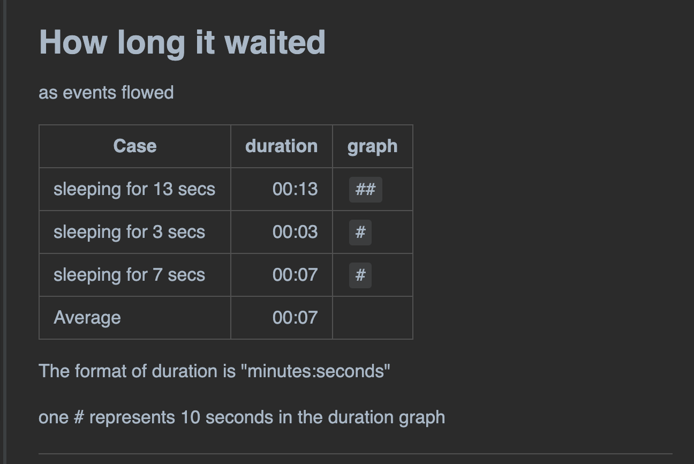
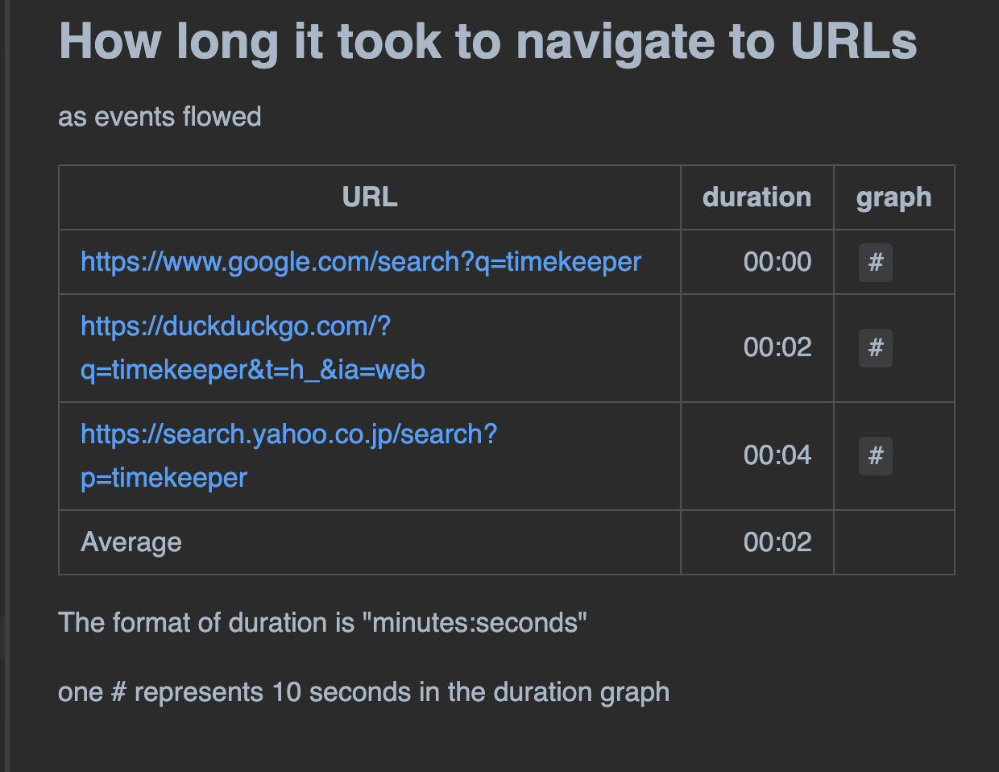

-   [Timekeeper](#timekeeper)
    -   [Motivation](#motivation)
    -   [Processing outline](#processing-outline)
    -   [Examples](#examples)
        -   [Example1 Minimalistic](#example1-minimalistic)
        -   [Example2 HTTP GET & save HTML](#example2-http-get-save-html)
        -   [Example3 Selenium test](#example3-selenium-test)
    -   [API](#api)
    -   [Download](#download)
    -   [Dependencies](#dependencies)
    -   [Repository](#repository)
    -   [Details](#details)
        -   [Sorting rows in table](#sorting-rows-in-table)
        -   [Options of report formatting](#options-of-report-formatting)
        -   [Report in CSV format](#report-in-csv-format)

# Timekeeper

Timekeeper is a Java/Groovy library that helps tests to compile performance reports in Markdown.

## Motivation

Often I develop Web UI tests in Groovy using Selenium. I want to measure the performance of the tests. Often I want to measure:

1.  how long (seconds) tests take to navigate to a URL in browser

2.  how long tests take to take and save screenshot of a web page

3.  how large (bytes) is the generated image file

And I want to examine many URLs; 100 or more. In practice, most of URL respond within 10 seconds but a few of them sometimes respond slow (over 30 seconds). Why? What happened? I need to list the slow URLs and look into them.

The 1st problem is that it is bothersome recording the duration using a stopwatch device. I introduced the Apache Commons [StopWatch](https://commons.apache.org/proper/commons-lang/apidocs/org/apache/commons/lang3/time/StopWatch.html) library into my test scripts to measure the duration and print the figure in console messages.

The 2nd problem is that it is difficult to find useful information out of the bulk of console messages. I want to summarise the statistics. But it is too tiresome to write manually a statistics report in Markdown table format.

I want to automate these tasks entirely. I want my tests to perform not only measuring performance but also compiling a concise report in Markdown format. Here comes the Timekeeper!

## Processing outline

Here is an outline of a test script which uses the Timekeeper to measure performance and print a report.

1.  Your test script should create a `Measurement` object, which is a container of `Record` objects. A `Measurement` requires you to define a set of table column names, like "Case" ad "URL".

2.  While performing a test (e.g, visiting URLs), your test script will make a record, and write the "startAt" timestamp before an action, and the "endAt" timestamp after the action. You may also put some "size" information into the record (e.g, the size of downloaded file).

3.  The `Record` objects should be stored in the `Measurement` object.

4.  Your test script will repeat creating `Record` s and putting them into the `Measurement` object as many times as you wants to. For example, you may visit 100 URLs and create 100 Records in a Measurement.

5.  Your test script wants to make a `Table` object, which wraps a `Measurement` object and the information how you want it formatted in a text report. For example, you can specify how the rows of the Table to be sorted.

6.  Your test script want to create a `Timekeeper` object. Your script will put one or more `Table` objects. Finally your test will call Timekeeper’s report() method which will write a text file. The report will contain one or more tables in Markdown format.

## Examples

### Example1 Minimalistic

The following example is a minimalistic example of utilizing the Timekeeper library, in Groovy using JUnit5.

    package com.kazurayam.timekeeper_demo

    import com.kazurayam.timekeeper.Measurement
    import com.kazurayam.timekeeper.Table
    import com.kazurayam.timekeeper.Timekeeper
    import org.junit.jupiter.api.BeforeAll
    import org.junit.jupiter.api.Disabled
    import org.junit.jupiter.api.Test

    import java.nio.file.Files
    import java.nio.file.Path
    import java.nio.file.Paths
    import java.time.LocalDateTime

    // This test takes 2 minutes to finish
    @Disabled
    class TimekeeperDemoMinimal {

        private static Path outDir_

        @BeforeAll
        static void setupClass() {
            outDir_ = Paths.get(".")
                    .resolve("build/tmp/testOutput")
                    .resolve(TimekeeperDemoMinimal.class.getSimpleName())
            if (Files.exists(outDir_)) {
                outDir_.toFile().deleteDir();
            }
            Files.createDirectory(outDir_)
        }

        @Test
        void demo_planned_sleep() {
            Timekeeper tk = new Timekeeper()
            Measurement m1 = new Measurement.Builder("How long it waited",
                    ["Case"]).build()
            tk.add(new Table.Builder(m1).build())
            doRecording(m1)
            tk.report(outDir_.resolve("planned_sleep.md"))
        }

        private void doRecording(Measurement m1) {
            for (int i in [13, 3, 7]) {
                LocalDateTime beforeSleep = LocalDateTime.now()
                // do a processing that could take long time.
                Thread.sleep(i * 1000L)
                LocalDateTime afterSleep = LocalDateTime.now()
                m1.recordDuration(["Case": "sleeping for " + i + " secs"],
                        beforeSleep, afterSleep)

This code outputs the following Markdown text.

    ## How long it waited

    as events flowed

    |Case|duration|graph|
    |:----|----:|:----|
    |sleeping for 13 secs|00:13|`##`|
    |sleeping for 3 secs|00:03|`#`|
    |sleeping for 7 secs|00:07|`#`|
    |Average|00:07| |

    The format of duration is "minutes:seconds"

    one # represents 10 seconds in the duration graph

This Markdown text will be rendered like this:

### Example2 HTTP GET & save HTML

The following code processes a list URLs. It makes HTTP GET request, save the request body into file. It checks the size of the file in bytes, and measures the duration of HTTP GET request.

    package com.kazurayam.timekeeper_demo

    import com.kazurayam.timekeeper.Measurement
    import com.kazurayam.timekeeper.RowOrder
    import com.kazurayam.timekeeper.Table
    import com.kazurayam.timekeeper.Timekeeper
    import org.junit.jupiter.api.BeforeAll
    import org.junit.jupiter.api.Disabled
    import org.junit.jupiter.api.Test

    import java.nio.file.Files
    import java.nio.file.Path
    import java.nio.file.Paths
    import java.time.LocalDateTime

    // this test takes 3 minutes to finish
    @Disabled
    class TimekeeperDemoHttpInteraction {

        private static Path outDir_
        private static List<String> urlList = [
                "case 1|https://www.google.com/search?q=timekeeper",
                "case 1|https://duckduckgo.com/?q=timekeeper&t=h_&ia=web",
                "case 1|https://search.yahoo.co.jp/search?p=timekeeper",
                "case 2|https://www.google.com/search?q=timekeeper",
                "case 2|https://duckduckgo.com/?q=timekeeper&t=h_&ia=web",
                "case 3|https://duckduckgo.com/?q=timekeeper&t=h_&ia=web",
        ]

        @BeforeAll
        static void setupClass() {
            outDir_ = Paths.get(".")
                    .resolve("build/tmp/testOutput")
                    .resolve(TimekeeperDemoHttpInteraction.class.getSimpleName())
            if (Files.exists(outDir_)) {
                outDir_.toFile().deleteDir()
            }
            Files.createDirectory(outDir_)
        }

        @Test
        void test_HTTPGetAndSaveResponse() {
            Timekeeper tk = new Timekeeper()
            Measurement interactions = new Measurement.Builder(
                    "get URL, save HTML into file", ["Case", "URL"]).build()
            // interact with URL, save the HTML into files
            processURLs(urlList, outDir_, interactions)
            // print the report
            Table table = new Table.Builder(interactions).build()
            tk.add(table)
            tk.report(outDir_.resolve("report.md"))
        }

        static void processURLs(List<String> urlList, Path outDir, Measurement m) {
            for (line in urlList) {
                String[] items = line.split("\\|")
                URL url = new URL(items[1])
                // mark the startAt timestamp
                LocalDateTime beforeGet = LocalDateTime.now()
                // do the heavy task
                String content = getHttpResponceContent(url)
                // mark the endAt timestamp
                LocalDateTime afterGet = LocalDateTime.now()
                File outFile = outDir.resolve(url.getHost() + ".html").toFile()
                outFile.text = content
                // record the stats
                m.recordSizeAndDuration(
                        ["Case": items[0], "URL": items[1]],
                        outFile.length(),   // size of the HTTP response body
                        beforeGet,          // startAt
                        afterGet            // endAt
                )
            }
        }

        static String getHttpResponceContent(URL url) {
            HttpURLConnection con = (HttpURLConnection) url.openConnection()
            con.setRequestMethod("GET")
            con.setConnectTimeout(5000)
            con.setReadTimeout(5000)
            int status = con.getResponseCode()
            Reader streamReader
            if (status > 299) {
                streamReader = new InputStreamReader(con.getErrorStream())
            } else {
                streamReader = new InputStreamReader(con.getInputStream())
            }
            BufferedReader br = new BufferedReader(streamReader)
            String inputLine
            StringBuffer sb = new StringBuffer()
            while ((inputLine = br.readLine()) != null) {
                sb.append(inputLine)
            }
            streamReader.close()
            con.disconnect()

This code will output the following Markdown text.

    ## get URL, save HTML into file

    as events flowed

    |Case|URL|size|duration|graph|
    |:----|:----|----:|----:|:----|
    |case 1|https://www.google.com/search?q=timekeeper|7,177|00:06|`#`|
    |case 1|https://duckduckgo.com/?q=timekeeper&t=h_&ia=web|156|00:03|`#`|
    |case 1|https://search.yahoo.co.jp/search?p=timekeeper|21,026|00:04|`#`|
    |case 2|https://www.google.com/search?q=timekeeper|7,189|00:03|`#`|
    |case 2|https://duckduckgo.com/?q=timekeeper&t=h_&ia=web|156|00:04|`#`|
    |case 3|https://duckduckgo.com/?q=timekeeper&t=h_&ia=web|156|00:01|`#`|
    |Average|-|5,976|00:03| |

    The unit of size is bytes

    The format of duration is "minutes:seconds"

    one # represents 10 seconds in the duration graph

### Example3 Selenium test

Input CSV file is here:

    https://www.google.com/search?q=timekeeper,timekeeper_google.png
    https://duckduckgo.com/?q=timekeeper&t=h_&ia=web,timekeeper_duckduckgo.png
    https://search.yahoo.co.jp/search?p=timekeeper,timekeeper_yahoo.png

The test emits the following Markdown text:

    ## How long it took to navigate to URLs

    as events flowed

    |URL|duration|graph|
    |:----|----:|:----|
    |https://www.google.com/search?q=timekeeper|00:00|`#`|
    |https://duckduckgo.com/?q=timekeeper&t=h_&ia=web|00:02|`#`|
    |https://search.yahoo.co.jp/search?p=timekeeper|00:04|`#`|
    |Average|00:02| |

    The format of duration is "minutes:seconds"

    one # represents 10 seconds in the duration graph

This Markdown text will be rendered on browser like this:

The code is here:

-   [com.kazurayam.timekeeper\_demo.TimekeeperDemoWithSelenium](https://github.com/kazurayam/timekeeper/blob/master/src/test/groovy/com/kazurayam/timekeeper_demo/TimekeeperDemoWithSelenium.groovy)

## API

Javadoc is [here](./api/index.html)

## Download

The artifact is available at the Maven Central repository:

-   <https://mvnrepository.com/artifact/com.kazurayam/timekeeper>

## Dependencies

Timekeeper was tested on Java8.

See `build.gradle` at <https://github.com/kazurayam/timekeeper/> for external dependencies.

## Repository

-   <https://github.com/kazurayam/timekeeper>

## Details

### Sorting rows in table

As soon as you get a table generated by Timekeeper, you would feel like to sort it for better readability. Timekeeper is capable of it. Timekeeper supports sorting rows by multiple selected keys. It is possible to sort rows in either of ascending and descending order.

Let me show you a few examples of sorting rows.

Here I use a term "Attributes" to categorise the column names of a table such as "Case", "URL", etc. "Attributes" does not include the recorded numbers: size and duration.

You can find a sample code at

-   [TimekeeperDemoHttpInteraction.groovy](https://github.com/kazurayam/timekeeper/blob/master/src/test/groovy/com/kazurayam/timekeeper_demo/TimekeeperDemoHttpInteraction.groovy)

#### Sort by attributes

The sample code has this method:

        //-----------------------------------------------------------------

        @Test
        void test_HTTPGetAndSaveResponse_sortByAttributes() {
            Timekeeper tk = new Timekeeper()
            Measurement interactions = new Measurement.Builder(
                    "get URL, save HTML into file", ["Case", "URL"]).build()
            // interact with URL, save the HTML into files
            processURLs(urlList, outDir_, interactions)
            // print the report
            Table table = new Table.Builder(interactions)
                    .sortByAttributes().noLegend().build()

Please note the following fragment:

                .sortByAttributes()

This fragment specifies Timekeeper to sort the rows by all Attributes of the table. If you have 2 or more attributes in the table, the left column has higher sorting priority than its right. In this example, the sorting key is : "Case" &gt; "URL".

Rows are sorted in ascending order unless the order is explicitly specified.

The output looks like this:

    ## get URL, save HTML into file

    sorted by attributes (ascending)

    |Case|URL|size|duration|graph|
    |:----|:----|----:|----:|:----|
    |case 1|https://duckduckgo.com/?q=timekeeper&t=h_&ia=web|156|00:04|`#`|
    |case 1|https://search.yahoo.co.jp/search?p=timekeeper|21,026|00:05|`#`|
    |case 1|https://www.google.com/search?q=timekeeper|7,189|00:04|`#`|
    |case 2|https://duckduckgo.com/?q=timekeeper&t=h_&ia=web|156|00:03|`#`|
    |case 2|https://www.google.com/search?q=timekeeper|7,153|00:06|`#`|
    |case 3|https://duckduckgo.com/?q=timekeeper&t=h_&ia=web|156|00:03|`#`|
    |Average|-|5,972|00:04| |

#### Sort by attributes in descending order

You can sort in descending order.

            tk.report(outDir_.resolve("sortByAttributes_URL.md"))
        }

        @Test
        void test_HTTPGetAndSaveResponse_sortByAttributes_descending() {
            Timekeeper tk = new Timekeeper()
            Measurement interactions = new Measurement.Builder(
                    "get URL, save HTML into file", ["Case", "URL"]).build()
            // interact with URL, save the HTML into files
            processURLs(urlList, outDir_, interactions)
            // print the report
            Table table = new Table.Builder(interactions)
                    .sortByAttributes( RowOrder.DESCENDING ).noLegend().build()

Please note this fragment where you specify the descending order.

        .sortByAttributes(Measurement.ROW_ORDER.DESCENDING).

The output looks like this:

    ## get URL, save HTML into file

    sorted by attributes (descending)

    |Case|URL|size|duration|graph|
    |:----|:----|----:|----:|:----|
    |case 3|https://duckduckgo.com/?q=timekeeper&t=h_&ia=web|156|00:01|`#`|
    |case 2|https://www.google.com/search?q=timekeeper|7,177|00:02|`#`|
    |case 2|https://duckduckgo.com/?q=timekeeper&t=h_&ia=web|156|00:03|`#`|
    |case 1|https://www.google.com/search?q=timekeeper|7,165|00:05|`#`|
    |case 1|https://search.yahoo.co.jp/search?p=timekeeper|21,026|00:03|`#`|
    |case 1|https://duckduckgo.com/?q=timekeeper&t=h_&ia=web|156|00:03|`#`|
    |Average|-|5,972|00:03| |

#### Sort by selected items of attributes

You can choose columns as sort key out of the Attributes.

            tk.report(outDir_.resolve("sortByAttributes.md"))
        }

        @Test
        void test_HTTPGetAndSaveResponse_sortByAttributes_URL() {
            Timekeeper tk = new Timekeeper()
            Measurement interactions = new Measurement.Builder(
                    "get URL, save HTML into file", ["Case", "URL"]).build()
            // interact with URL, save the HTML into files
            processURLs(urlList, outDir_, interactions)
            // print the report
            Table table = new Table.Builder(interactions)
                    .sortByAttributes(["URL"]).noLegend().build()

Please note the following fragment:

    Measurement interactions = new Measurement.Builder(
        "get URL, save HTML into file",
        ["Case", "URL"])
                    .sortByAttributes(["URL"]).
                    build();

The table has 2 attributes "Case" and "URL". And you selected "URL" as the single sort key.

The output will look like this:

    ## get URL, save HTML into file

    sorted by attributes (ascending)

    |Case|URL|size|duration|graph|
    |:----|:----|----:|----:|:----|
    |case 1|https://duckduckgo.com/?q=timekeeper&t=h_&ia=web|156|00:02|`#`|
    |case 2|https://duckduckgo.com/?q=timekeeper&t=h_&ia=web|156|00:05|`#`|
    |case 3|https://duckduckgo.com/?q=timekeeper&t=h_&ia=web|156|00:02|`#`|
    |case 1|https://search.yahoo.co.jp/search?p=timekeeper|21,026|00:05|`#`|
    |case 1|https://www.google.com/search?q=timekeeper|7,189|00:06|`#`|
    |case 2|https://www.google.com/search?q=timekeeper|7,197|00:06|`#`|
    |Average|-|5,980|00:04| |

#### Sort by duration

You can sort rows by duration.

            tk.report(outDir_.resolve("sortByAttributesThenDuration.md"))
        }

        @Test
        void test_HTTPGetAndSaveResponse_sortByDuration_descending() {
            Timekeeper tk = new Timekeeper()
            Measurement interactions = new Measurement.Builder(
                    "get URL, save HTML into file", ["Case", "URL"]).build()
            // interact with URL, save the HTML into files
            processURLs(urlList, outDir_, interactions)
            // print the report
            Table table = new Table.Builder(interactions)
                    .sortByDuration( RowOrder.DESCENDING ).noLegend().build()

The output is like this:

    ## get URL, save HTML into file

    sorted by duration (descending)

    |Case|URL|size|duration|graph|
    |:----|:----|----:|----:|:----|
    |case 2|https://www.google.com/search?q=timekeeper|7,177|00:05|`#`|
    |case 3|https://duckduckgo.com/?q=timekeeper&t=h_&ia=web|156|00:04|`#`|
    |case 1|https://duckduckgo.com/?q=timekeeper&t=h_&ia=web|156|00:03|`#`|
    |case 2|https://duckduckgo.com/?q=timekeeper&t=h_&ia=web|156|00:03|`#`|
    |case 1|https://search.yahoo.co.jp/search?p=timekeeper|21,026|00:03|`#`|
    |case 1|https://www.google.com/search?q=timekeeper|7,177|00:02|`#`|
    |Average|-|5,974|00:03| |

#### Sort by attributes and then by duration

You can sort rows by Attributes first, then secondly by duration. Perhaps this is the most useful way of sorting a Timekeeper’s table.

            tk.report(outDir_.resolve("sortByAttributes_descending.md"))
        }

        @Test
        void test_HTTPGetAndSaveResponse_sortByAttributesThenDuration() {
            Timekeeper tk = new Timekeeper()
            Measurement interactions = new Measurement.Builder(
                    "get URL, save HTML into file", ["Case", "URL"]).build()
            // interact with URL, save the HTML into files
            processURLs(urlList, outDir_, interactions)
            // print the report
            Table table = new Table.Builder(interactions)
                    .sortByAttributes().thenByDuration().noLegend().build()

The output looks like this:

    ## get URL, save HTML into file

    sorted by attributes then duration (ascending)

    |Case|URL|size|duration|graph|
    |:----|:----|----:|----:|:----|
    |case 1|https://duckduckgo.com/?q=timekeeper&t=h_&ia=web|156|00:02|`#`|
    |case 1|https://search.yahoo.co.jp/search?p=timekeeper|21,026|00:02|`#`|
    |case 1|https://www.google.com/search?q=timekeeper|7,165|00:05|`#`|
    |case 2|https://duckduckgo.com/?q=timekeeper&t=h_&ia=web|156|00:02|`#`|
    |case 2|https://www.google.com/search?q=timekeeper|7,177|00:05|`#`|
    |case 3|https://duckduckgo.com/?q=timekeeper&t=h_&ia=web|156|00:01|`#`|
    |Average|-|5,972|00:03| |

#### Sort by size

You can sort rows by size, of course.

        }

        @Test
        void test_HTTPGetAndSaveResponse_sortBySize_ascending() {
            Timekeeper tk = new Timekeeper()
            Measurement interactions = new Measurement.Builder(
                    "get URL, save HTML into file", ["Case", "URL"]).build()
            // interact with URL, save the HTML into files
            processURLs(urlList, outDir_, interactions)
            // print the report
            Table table = new Table.Builder(interactions)
                    .sortBySize().noLegend().build()

The output is like this:

    ## get URL, save HTML into file

    sorted by size

    |Case|URL|size|duration|graph|
    |:----|:----|----:|----:|:----|
    |case 1|https://duckduckgo.com/?q=timekeeper&t=h_&ia=web|156|00:04|`#`|
    |case 2|https://duckduckgo.com/?q=timekeeper&t=h_&ia=web|156|00:01|`#`|
    |case 3|https://duckduckgo.com/?q=timekeeper&t=h_&ia=web|156|00:01|`#`|
    |case 1|https://www.google.com/search?q=timekeeper|7,189|00:03|`#`|
    |case 2|https://www.google.com/search?q=timekeeper|7,189|00:03|`#`|
    |case 1|https://search.yahoo.co.jp/search?p=timekeeper|21,026|00:03|`#`|
    |Average|-|5,978|00:03| |

#### Sort by a chain of `RecordComparator`

The `Table.Builder` class implements 3 \`sortBy\*()\`methods:

-   `.sortByAttributes(List<String>, RowOrder)`

-   `.sortByDuration(RowOrder)`

-   `.sortBySize(RowOrder)`

These can be followed by one or more `thenBy*()` methods:

-   `.thenByAttributes(List<String>, RowOrder)`

-   `.thenByDuratio(RowOrder)`

-   `.thenBySize(RowOrder)`

-   `.thenByAttributes(List<String>, RowOrder)`

-   `.thenByDuratio(RowOrder)`

-   `.thenBySize(RowOrder)`

You can make a chain of multiple `RecordComparators`. It is possible to chain 3 or more RecordComparators while specifying `RowOrder.ASCENDING` and `RowOrder.DESCENDING` to each comparators. For example, in Groovy, you can write:

    Measurement m = new Measurement.Builder("ID",
        ["Case", "URL"]).build()
    ...
    Table t = new Table.Builder(m)
        .sortByAttribute(["URL"], RowOrder.ASCENDING)
        .thenByAttribute(["Case], RowOrder.ASCENDING)
        .thenByDuration(RowOrder.DESCENDING)
        .build()

Please have a look at the source code of

-   [Table.Builder](https://github.com/kazurayam/timekeeper/blob/master/src/main/java/com/kazurayam/timekeeper/Table.java)

### Options of report formatting

The default format of Timekeeper report contains a few portions that may look verbose to you. You can opt them off. The options include:

1.  the legend of table

2.  the description how rows are sorted

3.  the duration graph

#### no legend

            doRecording(m1)
            tk.report(outDir_.resolve("noDescription.md"))
        }

        @Test
        void demo_noLegend() {
            Timekeeper tk = new Timekeeper()
            Measurement m1 = new Measurement.Builder("How long it waited", ["Case"]).build()
            tk.add(new Table.Builder(m1)
                    .noLegend()   // require no legend for the table

Please note the line of `.noLegend()`

output:

    ## How long it waited

    as events flowed

    |Case|duration|graph|
    |:----|----:|:----|
    |sleeping for 13 secs|00:13|`##`|
    |sleeping for 3 secs|00:03|`#`|
    |sleeping for 7 secs|00:07|`#`|
    |Average|00:07| |

Please note that there is no legend printed here.

#### no description

                m1.getLast().getDurationMillis() < 20 * 1000
            }
        }

        @Test
        void demo_noDescription() {
            Timekeeper tk = new Timekeeper()
            Measurement m1 = new Measurement.Builder("How long it waited", ["Case"]).build()
            tk.add(new Table.Builder(m1)
                    .noDescription()   // require no description

Please note the line of `.noDescription()`

    ## How long it waited

    |Case|duration|graph|
    |:----|----:|:----|
    |sleeping for 13 secs|00:13|`##`|
    |sleeping for 3 secs|00:03|`#`|
    |sleeping for 7 secs|00:07|`#`|
    |Average|00:07| |

    The format of duration is "minutes:seconds"

    one # represents 10 seconds in the duration graph

Please note that there is no description like "sorted by duration (ascending)" printed.

#### no duration graph

            doRecording(m1)
            tk.report(outDir_.resolve("noLegend.md"))
        }

        @Test
        void demo_noGraph() {
            Timekeeper tk = new Timekeeper()
            Measurement m1 = new Measurement.Builder("How long it waited", ["Case"]).build()
            tk.add(new Table.Builder(m1)
                    .noGraph()   // require no duration graph

Please note the line of `.noGraph()` here.

    ## How long it waited

    as events flowed

    |Case|duration|
    |:----|----:|
    |sleeping for 13 secs|00:13|
    |sleeping for 3 secs|00:03|
    |sleeping for 7 secs|00:07|
    |Average|00:07|

    The format of duration is "minutes:seconds"

    one # represents 10 seconds in the duration graph

Here there is no column of "graph".

#### The simplest report

You can call `.noDescription()`, `.noLegend()` and `.noGraph()` together.

            doRecording(m1)
            tk.report(outDir_.resolve("noGraph.md"))
        }

        @Test
        void demo_the_simplest() {
            Timekeeper tk = new Timekeeper()
            Measurement m1 = new Measurement.Builder("How long it waited", ["Case"]).build()
            tk.add(new Table.Builder(m1)
                    .noDescription()  // require no description
                    .noLegend()       // require no legend
                    .noGraph()        // require no duration graph

Then you will get output as follows, which has the simplest format that Timekeeper can print.

    ## How long it waited

    |Case|duration|
    |:----|----:|
    |sleeping for 13 secs|00:13|
    |sleeping for 3 secs|00:03|
    |sleeping for 7 secs|00:07|
    |Average|00:07|

This is the simplest format that Timekeeper can print.

### Report in CSV format

Timekeeper generates a report in Markdown text format as default.
Optionally you can generate a report in CSV format.

You want to specify the 2nd parameter to `Timekeeper#report(Path, Timekeeper.FORMAT.CSV)`

    import com.kazurayam.timekeeper.Timekeeper
    ...

        @Test
        void demo_with_selenium_report_CSV() {
            Timekeeper tk = runSeleniumTest();
            tk.report(outDir_.resolve("report.csv"), Timekeeper.FORMAT.CSV)
        }
