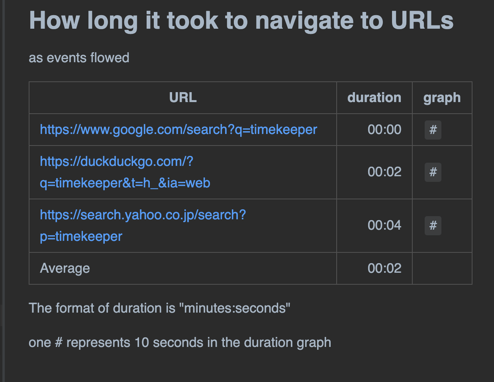

= Timekeeper

Timekeeper is a Java/Groovy library that helps tests to author performance reports in Markdown.

== Motivation

Often I develop Web UI tests in Groovy using Selenium. I want to measure the performance of the tests. Often I want to measure:

1. how long (seconds) tests take to navigate to a URL in browser
2. how long tests take to take and save screenshot of a web page
3. how large (bytes) is the generated image file

And I want to examine many URLs; 100 or more. In practice, most of URL respond within 10 seconds but a few of them sometimes respond slow (over 30 seconds). Why? What happened? I need to list the slow URLs and look into them.

The 1st problem is that it is bothersome recording the duration using a stopwatch device. I introduced the Apache Commons https://commons.apache.org/proper/commons-lang/apidocs/org/apache/commons/lang3/time/StopWatch.html[StopWatch] library into my test scripts to measure the duration and print the figure in console messages.

The 2nd problem is that it is difficult to find useful information out of the bulk of console messages. I want to summarise the statistics. But it is too tiresome to write manually a statistics report in Markdown table format.

I want to automate these tasks entirely. I want my tests to perform not only measuring performance but also compiling a concise report in Markdown format. Here comes the Timekeeper!

== Processing outline

Here is an outline of a test script which uses the Timekeeper to measure performance and print a report.

1. Your test script should create a `Measurement` object, which is a container of `Record` objects. A `Measurement` requires you to define a set of table column names, like "Case" ad "URL".
2. While performing a test (e.g, visiting URLs), your test script will make a record, and write the "startAt" timestamp before an action, and the "endAt" timestamp after the action. You may also put some "size" information into the record (e.g, the size of downloaded file).
3. The `Record` objects should be stored in the `Measurement` object.
4. Your test script will repeat creating `Record` s and putting them into the `Measurement` object as many times as you wants to. For example, you may visit 100 URLs and create 100 Records in a Measurement.
5. Your test script wants to make a `Table` object, which wraps a `Measurement` object and the information how you want it formatted in a text report. For example, you can specify how the rows of the Table to be sorted.
6. Your test script want to create a `Timekeeper` object. Your script will put one or more `Table` objects. Finally your test will call Timekeeper's report() method which will write a text file. The report will contain one or more tables in Markdown format.

== Examples

=== Example1 Minimalistic

The following example is a minimalistic example of utilizing the Timekeeper library, in Groovy using JUnit5.

[source, groovy]
----
include::../src/test/groovy/com/kazurayam/timekeeper_demo/TimeKeeperDemoMinimal.groovy[lines=1..47]
----

This code outputs the following Markdown text.

[source]
----
include::./TimekeeperDemoMinimal/planned_sleep.md[]
----

This Markdown text will be rendered like this:

image::images/planned_sleep.png[planned sleep]

=== Example2 HTTP GET & save HTML

The following code processes a list URLs. It makes HTTP GET request, save the request body into file. It checks the size of the file in bytes, and measures the duration of HTTP GET request.

[source, groovy]
----
include::../src/test/groovy/com/kazurayam/timekeeper_demo/TimekeeperDemoHttpInteraction.groovy[lines=1..95]
----

This code will output the following Markdown text.

[source, markdown]
----
include::./TimekeeperDemoHttpInteraction/report.md[]
----

=== Example3 Selenium test

Input CSV file is here:

[source]
----
include::../src/test/fixtures/URLs.csv[]
----

The test emits the following Markdown text:

[source, markdown]
----
include::TimekeeperDemoWithSelenium/report.md[]
----

This Markdown text will be rendered on browser like this:

The code is here:

* https://github.com/kazurayam/timekeeper/blob/master/src/test/groovy/com/kazurayam/timekeeper_demo/TimekeeperDemoWithSelenium.groovy[com.kazurayam.timekeeper_demo.TimekeeperDemoWithSelenium]

== API

Javadoc is link:./api/index.html[here]

== Download

The artifact is available at the Maven Central repository:

- https://mvnrepository.com/artifact/com.kazurayam/timekeeper

== Dependencies

Timekeeper was tested on Java8.

See `build.gradle` at https://github.com/kazurayam/timekeeper/ for external dependencies.

== Repository

* https://github.com/kazurayam/timekeeper

== Details

=== Sorting rows in table

As soon as you get a table generated by Timekeeper, you would feel like to sort it for better readability. Timekeeper is capable of it. Timekeeper supports sorting rows by multiple selected keys. It is possible to sort rows in either of ascending and descending order.

Let me show you a few examples of sorting rows.

Here I use a term "Attributes" to categorise the column names of a table such as "Case", "URL", etc. "Attributes" does not include the recorded numbers: size and duration.

You can find a sample code at

* https://github.com/kazurayam/timekeeper/blob/master/src/test/groovy/com/kazurayam/timekeeper_demo/TimekeeperDemoHttpInteraction.groovy[TimekeeperDemoHttpInteraction.groovy]

==== Sort by attributes

The sample code has this method:

[source, groovy]
----
include::../src/test/groovy/com/kazurayam/timekeeper_demo/TimekeeperDemoHttpInteraction.groovy[lines=103..116]
----

Please note the following fragment:

[source]
----
            .sortByAttributes()
----

This fragment specifies Timekeeper to sort the rows by all Attributes of the table. If you have 2 or more attributes in the table, the left column has higher sorting priority than its right. In this example, the sorting key is : "Case" > "URL".

Rows are sorted in ascending order unless the order is explicitly specified.

The output looks like this:

[source, markdown]
----
include::./TimekeeperDemoHttpInteraction/sortByAttributes.md[]
----

==== Sort by attributes in descending order

You can sort in descending order.

[source, groovy]
----
include::../src/test/groovy/com/kazurayam/timekeeper_demo/TimekeeperDemoHttpInteraction.groovy[lines=131..143]
----

Please note this fragment where you specify the descending order.

[source]
----
    .sortByAttributes(Measurement.ROW_ORDER.DESCENDING).
----

The output looks like this:

[source,markdown]
----
include::./TimekeeperDemoHttpInteraction/sortByAttributes_descending.md[]
----

==== Sort by selected items of attributes

You can choose columns as sort key out of the Attributes.

[source, groovy]
----
include::../src/test/groovy/com/kazurayam/timekeeper_demo/TimekeeperDemoHttpInteraction.groovy[lines=117..129]
----

Please note the following fragment:

[source]
----
Measurement interactions = new Measurement.Builder(
    "get URL, save HTML into file",
    ["Case", "URL"])
                .sortByAttributes(["URL"]).
                build();
----

The table has 2 attributes "Case" and "URL". And you selected "URL" as the single sort key.

The output will look like this:

[source, markdown]
----
include::./TimekeeperDemoHttpInteraction/sortByAttributes_URL.md[]
----

==== Sort by duration

You can sort rows by duration.

[source, groovy]
----
include::../src/test/groovy/com/kazurayam/timekeeper_demo/TimekeeperDemoHttpInteraction.groovy[lines=159..171]
----

The output is like this:

[source, markdow]
----
include::./TimekeeperDemoHttpInteraction/sortByDuration_descending.md[]
----

==== Sort by attributes and then by duration

You can sort rows by Attributes first, then secondly by duration. Perhaps this is the most useful way of sorting a Timekeeper's table.

[source, groovy]
----
include::../src/test/groovy/com/kazurayam/timekeeper_demo/TimekeeperDemoHttpInteraction.groovy[lines=148..157]
----

The output looks like this:

[source, markdown]
----
include::./TimekeeperDemoHttpInteraction/sortByAttributesThenDuration.md[]
----

==== Sort by size

You can sort rows by size, of course.

[source, groovy]
----
include::../src/test/groovy/com/kazurayam/timekeeper_demo/TimekeeperDemoHttpInteraction.groovy[lines=174..186]
----

The output is like this:

[source, markdown]
----
include::./TimekeeperDemoHttpInteraction/sortBySize_ascending.md[]
----

==== Sort by a chain of `RecordComparator`

The `Table.Builder` class implements 3 `sortBy*()`methods:

* `.sortByAttributes(List<String>, RowOrder)`
* `.sortByDuration(RowOrder)`
* `.sortBySize(RowOrder)`

These can be followed by one or more `thenBy*()` methods:

* `.thenByAttributes(List<String>, RowOrder)`
* `.thenByDuratio(RowOrder)`
* `.thenBySize(RowOrder)`
* `.thenByAttributes(List<String>, RowOrder)`
* `.thenByDuratio(RowOrder)`
* `.thenBySize(RowOrder)`

You can make a chain of multiple `RecordComparators`. It is possible to chain 3 or more RecordComparators while specifying `RowOrder.ASCENDING` and `RowOrder.DESCENDING` to each comparators. For example, in Groovy, you can write:

----
Measurement m = new Measurement.Builder("ID",
    ["Case", "URL"]).build()
...
Table t = new Table.Builder(m)
    .sortByAttribute(["URL"], RowOrder.ASCENDING)
    .thenByAttribute(["Case], RowOrder.ASCENDING)
    .thenByDuration(RowOrder.DESCENDING)
    .build()
----

Please have a look at the source code of

* https://github.com/kazurayam/timekeeper/blob/master/src/main/java/com/kazurayam/timekeeper/Table.java[Table.Builder]

=== Options of report formatting

The default format of Timekeeper report contains a few portions that may look verbose to you. You can opt them off. The options include:

1. the legend of table
2. the description how rows are sorted
3. the duration graph

==== no legend

[source, groovy]
----
include::../src/test/groovy/com/kazurayam/timekeeper_demo/TimekeeperDemoMinimal.groovy[lines=60..69]
----

Please note the line of `.noLegend()`

output:

[source, markdown]
----
include::TimekeeperDemoMinimal/noLegend.md[]
----

Please note that there is no legend printed here.

==== no description

[source, groovy]
----
include::../src/test/groovy/com/kazurayam/timekeeper_demo/TimekeeperDemoMinimal.groovy[lines=49..58]
----

Please note the line of `.noDescription()`

[source, markdown]
----
include::TimekeeperDemoMinimal/noDescription.md[]
----

Please note that there is no description like "sorted by duration (ascending)" printed.

==== no duration graph

[source, groovy]
----
include::../src/test/groovy/com/kazurayam/timekeeper_demo/TimekeeperDemoMinimal.groovy[lines=71..80]
----

Please note the line of `.noGraph()` here.

[source, markdown]
----
include::TimekeeperDemoMinimal/noGraph.md[]
----

Here there is no column of "graph".

==== The simplest report

You can call `.noDescription()`, `.noLegend()` and `.noGraph()` together.

[source, groovy]
----
include::../src/test/groovy/com/kazurayam/timekeeper_demo/TimekeeperDemoMinimal.groovy[lines=82..93]
----

Then you will get output as follows, which has the simplest format that Timekeeper can print.

[source, markdown]
----
include::TimekeeperDemoMinimal/the_simplest.md[]
----

This is the simplest format that Timekeeper can print.

=== Report in CSV format

Timekeeper generates a report in Markdown text format as default.
Optionally you can generate a report in CSV format.

You want to specify the 2nd parameter to `Timekeeper#report(Path, Timekeeper.FORMAT.CSV)`
----
import com.kazurayam.timekeeper.Timekeeper
...

    @Test
    void demo_with_selenium_report_CSV() {
        Timekeeper tk = runSeleniumTest();
        tk.report(outDir_.resolve("report.csv"), Timekeeper.FORMAT.CSV)
    }
----

== Related links

-  GitHub repository link:https://github.com/kazurayam/timekeeper/[kazurayam/timekeeper]
